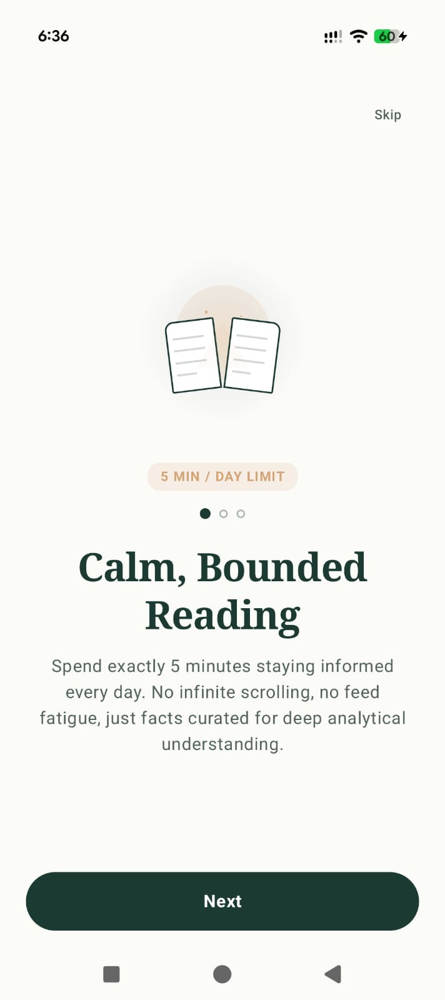
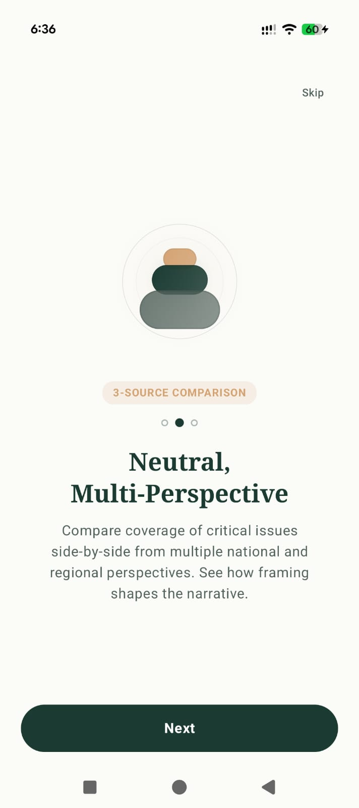
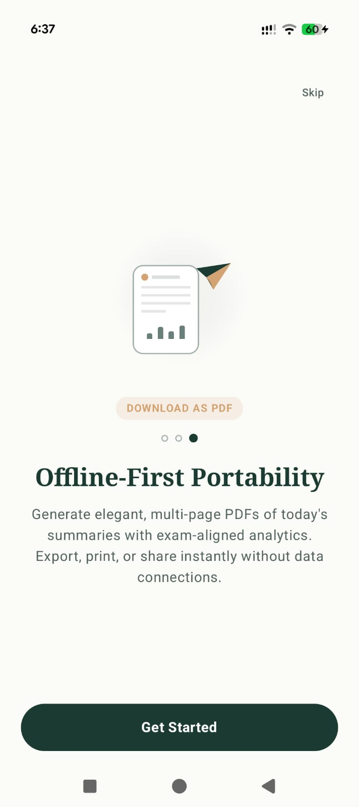
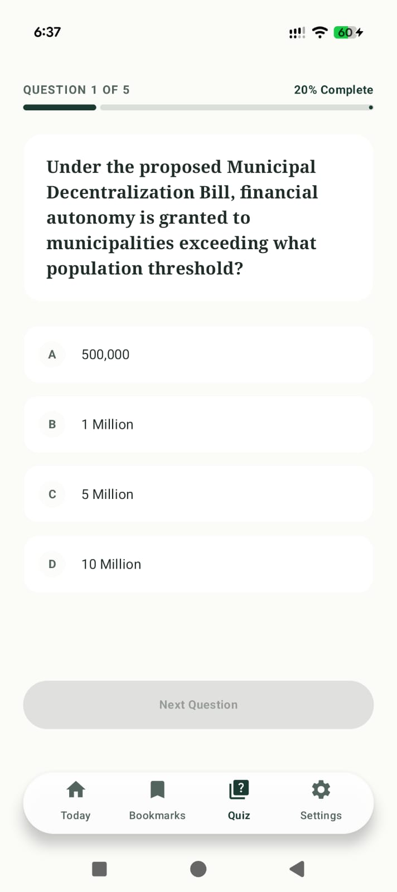
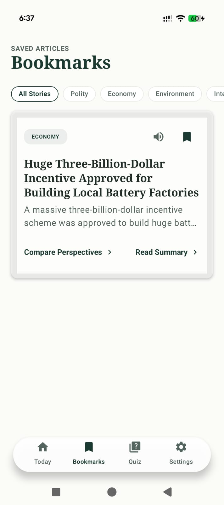
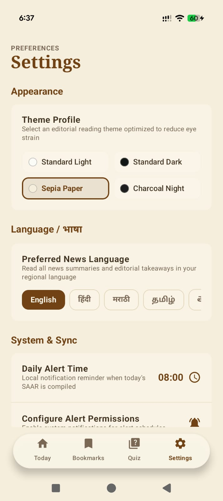

<div align="center">

# SAAR (सार)
### A bounded, 5-minute daily current-affairs digest

*सार — Hindi for "essence" or "gist."*

</div>

## Screenshots

| | | |
|---|---|---|
|  |  |  |
| Onboarding: 5-min bounded reading | Onboarding: 3-source comparison | Onboarding: offline-first PDF export |
|  |  |  |
| Today's SAAR — Deep Dives / Daily Pulse | Editorial Analysis tab | Bookmarks |
|  |  |  |
| Daily Quiz | Settings — Standard Dark theme | Settings — Sepia Paper theme |

---

## 1. The problem

News and current-affairs apps are almost universally built on an attention-economy model: infinite scroll, algorithmic feeds, push notifications optimized for re-engagement rather than comprehension. For a specific, high-intent user — a student preparing for a competitive exam (UPSC, banking, SSC) or anyone who wants to stay genuinely informed without losing an hour to a feed — this is the wrong product shape. The job-to-be-done isn't "keep me scrolling," it's **"tell me what happened today, why it matters, and let me get back to my life."**

Saar is designed around that job. It deliberately does not have an infinite feed. It has a bounded daily set of stories, an explicit "you're caught up" end state, and a structure (Context → Key Points → Why It Matters → Exam Angle) borrowed from how a good teacher would explain the news, not how a newsroom would publish it.

## 2. Target user & use case

**Primary persona:** A competitive-exam aspirant (UPSC/banking/SSC) who needs daily current-affairs coverage but doesn't have time to read three newspapers, and needs the "exam angle" — what's actually testable — extracted for them.

**Secondary persona:** A generally curious reader who wants a calm, complete daily briefing instead of a feed they can't stop scrolling.

**Core use case:** Open the app once a day, spend ~5 minutes on the day's digest, optionally take the daily quiz to check retention, and close the app with a clear sense of completion rather than "there's more below."

## 3. Product principles

These are the design decisions that fall out of the problem above — useful context for anyone reading the code or extending the product:

| Principle | What it looks like in the app |
|---|---|
| **Boundedness over engagement** | The Today feed ends in a "you're caught up" state, not an infinite scroll |
| **Comprehension over speed** | Each story has a fixed explanatory structure (Context, Key Points, Why It Matters) rather than a raw headline + link |
| **Bias-awareness as a feature** | The Compare Coverage screen explicitly shows three differently-framed takes (institutional / community / analytical) on the same story, so the user builds a sense of how framing works — instead of the app pretending to be neutral |
| **Retention, not just consumption** | The Daily Quiz turns passive reading into active recall, with results tracked over time |
| **Respect for the user's data and time** | Zero login, local-first storage (Room + DataStore), an explicit Data Saver toggle, and offline PDF export — the app assumes intermittent connectivity and exam-season time pressure |

## 4. Feature breakdown

### Today's Digest (Home)
The daily entry point, now split into two sub-tabs:
- **Deep Dives** — the original long-form stories (Context, Key Points, Why It Matters, Exam Angle)
- **Daily Pulse** — shorter, citizen-impact briefs (consumer guidelines, sports, local tech, national measures) that don't need the full deep-dive treatment

Stories are grouped by category (Polity, Economy, Environment, International Relations, Science, Other) with a read/unread and bookmark state per story. Each sub-tab ends in a fixed "you're caught up" card rather than continuing to load content — the boundedness principle made literal. A manual **Refresh** button on Home lets the user force a re-sync of the day's news on demand.

### Story detail
Each digest item expands into:
- **Context** — background needed to understand the story
- **Key Points** — the bullet-level facts
- **Why It Matters** — implication/analysis layer
- **Exam Angle** — a callout aimed specifically at the competitive-exam persona (e.g. "UPSC/Banking Aspirants: focus on X")

### Compare Coverage
Three-source side-by-side framing comparison (Source A: institutional, Source B: community, Source C: analytical) on the same underlying story. This is the bias-literacy feature — it doesn't tell the user what to think, it shows them *how the same facts get framed differently*.

### Editorial Analysis
Longer-form takeaway + full analysis for select stories that warrant deeper treatment than the daily digest format allows.

### Daily Quiz
A short multiple-choice quiz tied to the day's stories. Results (score, total questions, date) are persisted, so over time this becomes a personal retention signal, not just a one-off check.

### Live news sync (new)
Previously, Saar shipped with static seeded content only (`DatabaseSeeder.kt`). This build adds a real sync pipeline (`NewsSyncManager.kt`) that runs on app launch and on manual refresh:

1. **If a NewsAPI key is configured**, fetch today's top headlines for India, then send them to Gemini to be cleaned, simplified into plain language, and enriched into the full digest structure (Context, Key Points, Why It Matters, Exam Angle, three-source framing, Deep Dive vs. Daily Pulse classification).
2. **If no NewsAPI key is set, or the live fetch comes back empty/thin,** fall back to asking Gemini to generate 15–20 realistic, India-focused daily news briefs directly, in the same structured format.
3. **If both of the above fail** (no Gemini key, network error, malformed response), fall back to the original static seeded dataset so the app is never empty.

This is a deliberate three-tier fallback, not a "best effort" — the product principle (never show a broken or empty state) takes priority over always having live data. It also means the app is fully demoable with zero API keys configured, same as before.

A new `isDailyPulse` flag on each `DigestItem` (set by Gemini during generation, or manually in the seeder) drives the Deep Dives / Daily Pulse split on the Home screen.

### Bookmarks
Save any story for later. No folders/tags yet — intentionally simple for v1.

### PDF Export
Generates a downloadable PDF of the day's full digest (via Android's native `PdfDocument` API, not a web view or external library) — built for the offline/low-connectivity case explicitly.

### Settings
- Dark mode / theme profile
- Daily notification time (backed by WorkManager, persists across reboots)
- Data Saver (disables auto-downloading images)
- Per-topic content preferences (Polity, Economy, Environment, International Relations, Technology, Culture)
- Language preference + on-device translation via the Gemini API (cached locally so repeat translations don't re-hit the network)
- Optional "Support this project" UPI donation link

### Onboarding
A three-slide intro (5-minute digest promise → multi-source comparison → offline PDF) shown once, gated by a DataStore flag.

## 5. What's deliberately *not* in v1

Being explicit about scope is part of good product writing, so:
- No social features (sharing is OS-level share sheet only, no comments/likes)
- No personalized algorithmic ranking — topic preferences are a manual filter, not an ML feed (note: story *content* is now Gemini-generated/enriched, but story *selection/ordering* is still not personalized or ranked)
- No login/sync — all data is local to the device; uninstalling loses bookmarks and quiz history
- No licensing/legal review of source content — this is a portfolio/demo project, not a publishing product

## 6. Tech stack & architecture

**Language:** Kotlin
**UI:** Jetpack Compose + Material 3
**Architecture:** MVVM — `MainViewModel` exposes state to Compose screens, backed by `AppRepository`
**Persistence:** Room (digest items, editorial items, quiz questions/results, translation cache) + Jetpack DataStore (user preferences)
**Background work:** WorkManager — daily notification scheduling survives app restarts and device reboots
**Networking:** Retrofit/OkHttp + Moshi (JSON)
**AI:** Gemini API, used for two things: (1) on-demand translation, and (2) the live news pipeline — cleaning/simplifying real headlines and, as a fallback, generating realistic daily news briefs when no live source is available. Digest content is no longer purely static seed data; it's now synced/generated at runtime, with the static seed as a last-resort fallback.
**PDF generation:** Native Android `PdfDocument`
**Navigation:** Jetpack Navigation Compose
**Testing:** JUnit, Robolectric, Roborazzi (screenshot regression tests), Espresso

Min SDK 24 (Android 7.0+), target/compile SDK 36.

### Project structure

```
app/src/main/java/com/example/
├── data/
│   ├── Entities.kt              # DigestItem, EditorialItem, QuizQuestion, QuizResult, TranslationCache
│   ├── Category.kt              # Polity / Economy / Environment / InternationalRelations / Science / Other
│   ├── AppDao.kt, AppDatabase.kt, AppRepository.kt
│   ├── NewsSyncManager.kt       # Live news fetch (NewsAPI) + Gemini cleanup/enrichment + Gemini fallback generation
│   ├── PreferencesManager.kt    # DataStore-backed settings
│   └── DatabaseSeeder.kt        # Last-resort static seed data if sync fails entirely
├── ui/
│   ├── screens/                 # Onboarding, Home, Bookmarks, Quiz, Settings, SummaryDetail,
│   │                             # EditorialDetail, SourceComparison
│   ├── theme/                   # Color, Type, Theme
│   ├── AppNavigation.kt
│   └── MainViewModel.kt
├── utils/
│   ├── PdfGenerator.kt
│   ├── GeminiTranslationClient.kt
│   └── DateFormatter.kt
└── work/
    ├── NotificationWorker.kt
    └── NotificationScheduler.kt
```

### Data model (Room — v3)
- `digest_items` — one row per story, includes category, headline, the four explanatory text fields, three source-framing fields, date, read/bookmark flags, and a new `isDailyPulse` flag (true = short citizen-impact brief, false = long-form deep dive)
- `editorial_items` — title, takeaway, full analysis, date
- `quiz_questions` — question + 4 options + correct index, date-scoped
- `quiz_results` — score/total per date, for the retention-tracking use case
- `translation_cache` — keyed on (text hash, language) so repeat translations are free

## 7. Running locally

**Prerequisites:** [Android Studio](https://developer.android.com/studio)

1. Clone the repo and open it in Android Studio; let it sync.
2. Create a `.env` file in the project root:
   ```
   GEMINI_API_KEY=your_key_here
   NEWS_API_KEY=your_key_here   # optional — see below
   ```
   (see `.env.example`).
   - **Without `GEMINI_API_KEY`:** translation no-ops (falls back to original text), and the news sync pipeline falls all the way back to the static seeded dataset.
   - **With `GEMINI_API_KEY` but no `NEWS_API_KEY`:** on launch/refresh, the app asks Gemini to generate a realistic set of daily news briefs directly — no live source needed.
   - **With both keys:** the app fetches real top headlines (NewsAPI, India) and has Gemini clean/simplify/enrich them into the full digest format.
3. Run on an emulator or device (min SDK 24).

The app ships with seeded sample data (`DatabaseSeeder.kt`) as a last-resort fallback, so the full UI — Today feed (Deep Dives + Daily Pulse), story details, comparison, quiz, bookmarks — is explorable even with zero API keys configured.

## 8. Known issues / pre-publish checklist

- `SettingsScreen.kt` has a placeholder UPI ID (`YOUR_UPI_ID@upi`) for the optional donate link — replace with a real ID or remove the section before treating this as production-ready
- `applicationId` (`com.aistudio.digest.kxmpzq`) and `namespace` (`com.example`) are still AI-Studio-generated defaults — fine for a portfolio repo, but should be renamed (e.g. to a real reverse-domain ID) before any Play Store submission
- No automated CI pipeline configured yet (tests exist locally — JUnit/Robolectric/Roborazzi/Espresso — but aren't wired into GitHub Actions)
- The fallback path in `NewsSyncManager` (Gemini generating "realistic" news when no live NewsAPI key is present) produces synthetic content presented as today's news — fine for a demo/portfolio build, but worth a clear in-app disclosure before any real-world distribution
- Both the NewsAPI fetch and the Gemini calls happen synchronously on app launch with no visible loading state beyond the existing "you're caught up" pattern and the refresh spinner — worth a UX pass if sync latency is noticeable on slow connections

## 9. Possible roadmap (not built)

Listed here as product thinking, not as commitments:
- Sync/auth so bookmarks and quiz history survive a reinstall or move across devices
- Topic-preference-driven story ordering (still rule-based, not ML, to preserve the "no algorithmic feed" principle)
- Weekly/monthly retrospective view of quiz performance by category
- Export digest history beyond the current day (multi-day PDF compilation)
- Background (WorkManager-driven) news sync ahead of the daily notification, so content is already fresh when the user opens the app, instead of syncing on open

## 10. License

Personal/portfolio project. No license file included yet — open an issue if you want to use this and need clarification on terms.
